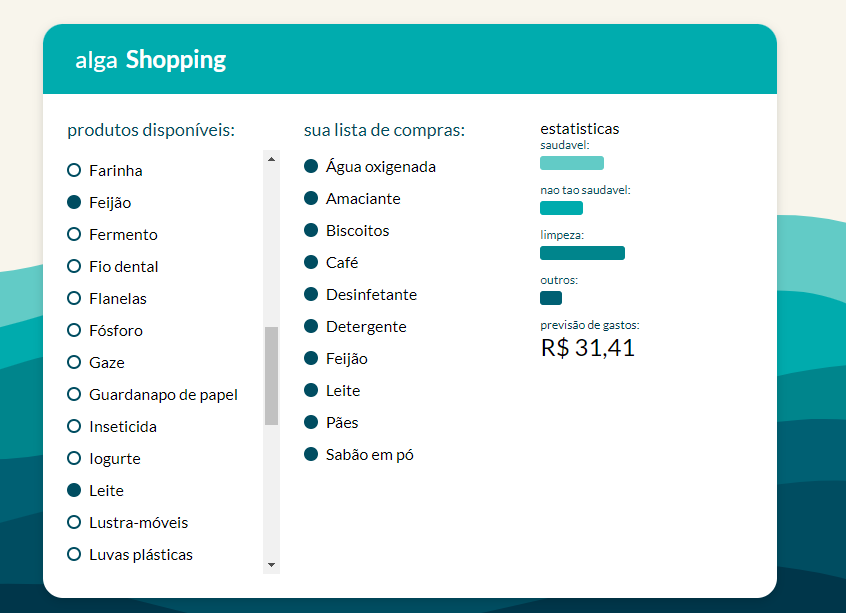
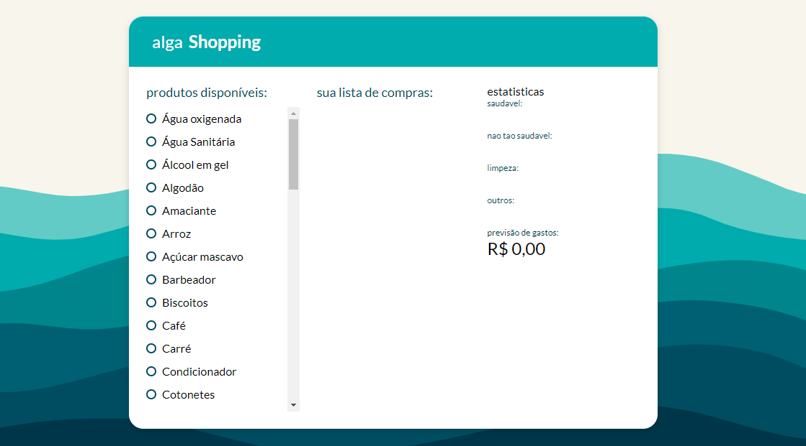

# ALGA SHOPPING 

Software de um carrinho de compras de um supermercado criado no workshop da algaWorks durante a imersão ReactJS e o desafio ReactJS 
 
Link: https://algashopping-raphael-lima.netlify.app

## Minha aplicação:  

 

 

## Tecnologias utilizadas:  

<ul>  

  <li>ReactJS</li>  

  <li>Redux</li>  

  <li>JavaScript</li>  

  <li>HTML</li>  

  <li>CSS</li>  

</ul>  

## Sobre a aplicação:  

Essa aplicação é muito comum em ecommerces em que o usuário pode adicionar ou remover produtos no seu carrinho de compras e a medida que realiza essa ação, ele consegue ver o peso de cada categoria de produtos na sua compra. Os dados usados nessa aplicação são todos "mockados" e a comunicação entre esses componentes foi feita com o framework Redux. 

## Ficaria feliz com Feedbacks:  

Email: raphaeldesousalm@gmail.com    

Linkdin: https://www.linkedin.com/in/raphaellima98/ 

 
